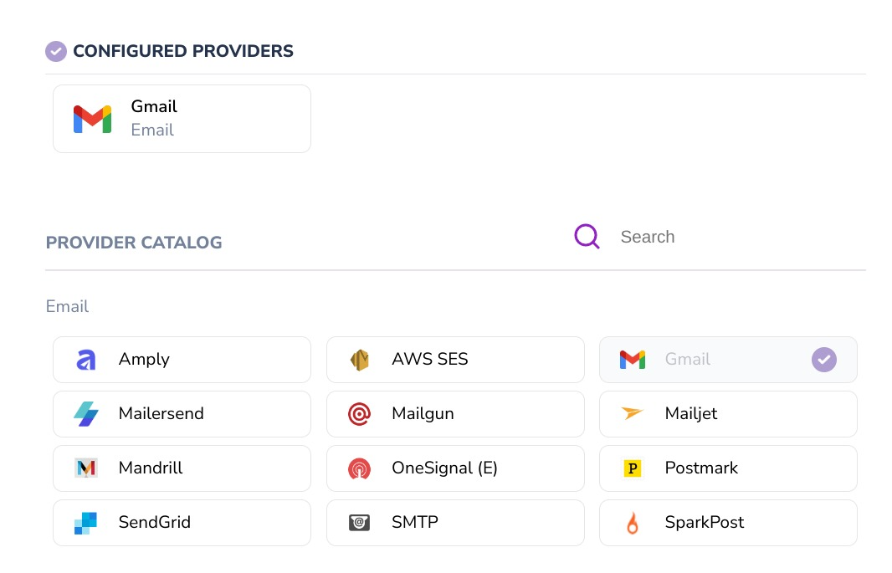
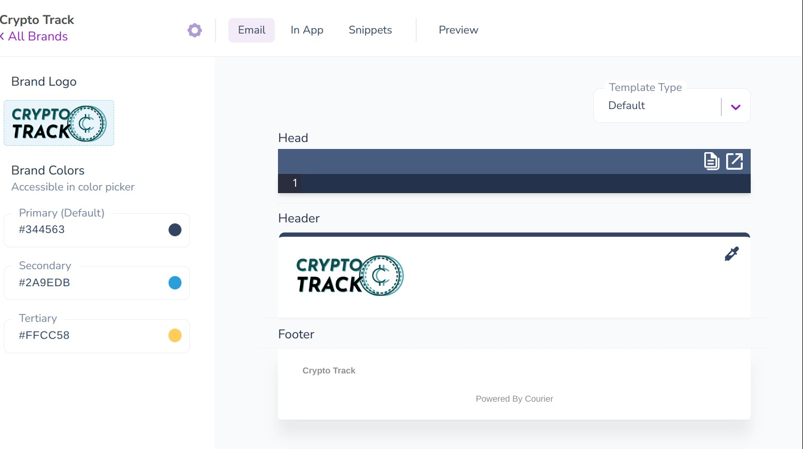
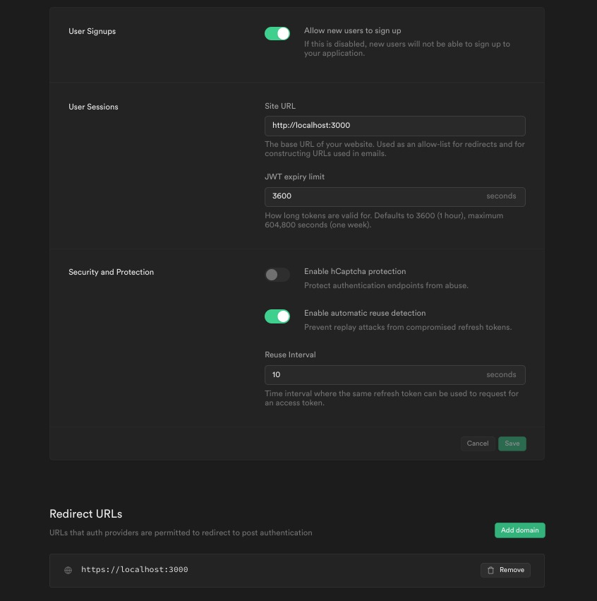
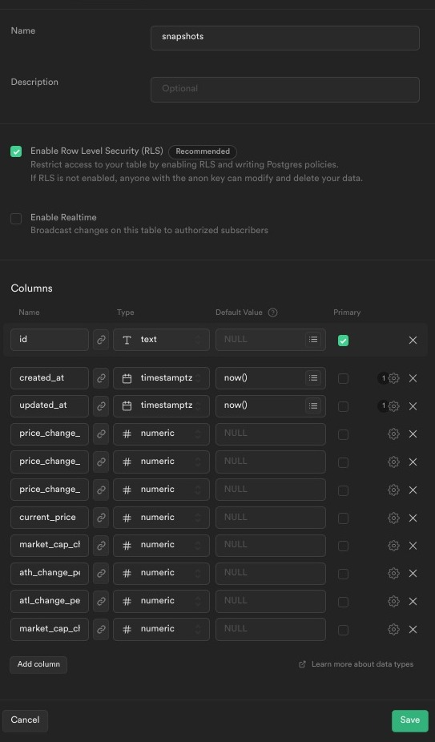
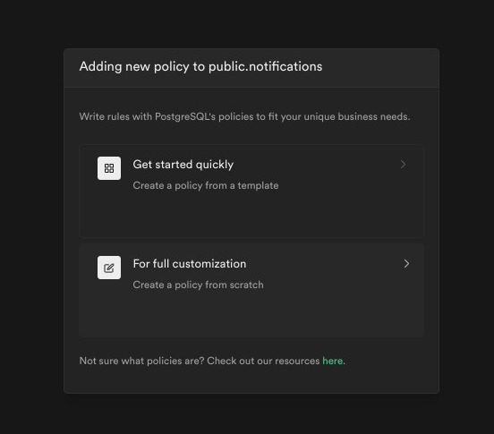
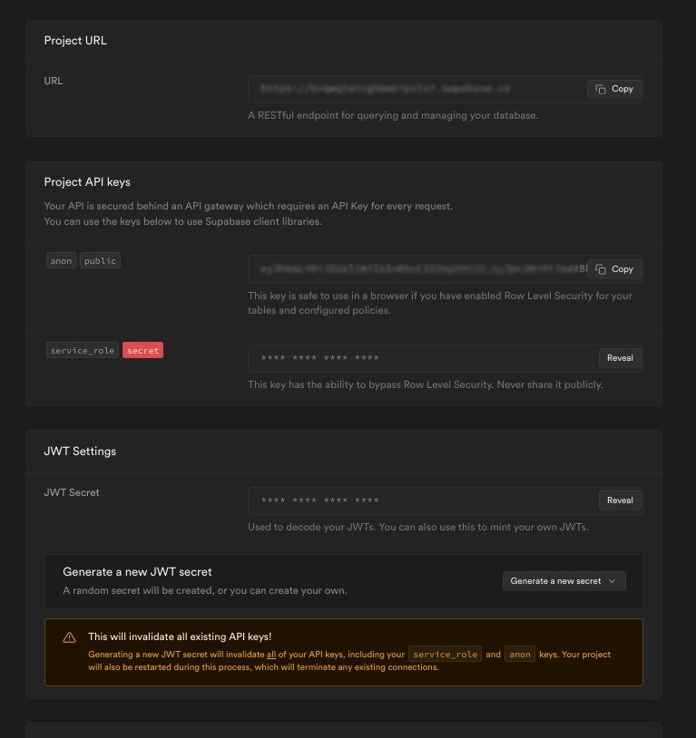

# Develop a Cryptocurrency Tracking WebApp with Instant Email Notifications

<p align="center">
  <a href="https://www.youtube.com/watch?v=a-kGJ8-OU2A">
    
  </a>
</p>

## Background

[Crypto Track](https://github.com/eyuelberga/CryptoTrack/) is a web application to help track market changes on your favorite cryptocurrency and receive instant email notifications. Cryptocurrency use is rapidly expanding, and many people are putting their money and resources into it. However, its volatility sets it apart from other assets. Even though staying current with market trends might be time-consuming, there are also considerable benefits to doing so. Crypto Track essentially aims to make this a lot easier by notifying subscribers when the desired change is reflected on the market. 

[Courier](http://courier.com/) is ideal for this kind of application since it makes it simple to integrate notification systems. We will be using the Courier API to send email notifications for now, but it is quite easy to extend it to use SMS or other communication channels.

We will also be using [Supabase](https://supabase.com/), an open-source alternative to firebase with a built-in database and authentication system. We will use [React](https://reactjs.org/) for building out the front end and [Chakra-UI](https://chakra-ui.com/) for styling our React components. We will also set up a cron job that calls a webhook (that we will be building using [Express](https://expressjs.com/)). We will also use the [CoinGecko(https://www.coingecko.com/)] API to fetch the latest cryptocurrency market data. 

I know that's a lot! But if you have a working knowledge of Javascript, React, and have worked with APIs in the past, you can easily follow along.


## Instructions

### Quick Overview

Let’s start with a quick overview of what we will be building. We have a web application with authentication. After login, users are presented with a simple form for subscribing to notifications. The form has options for selecting the market data metrics, the cryptocurrency, and when to be notified, by choosing a target value and the change(whether the current market data is greater than or less than the specified target value).  There is also a section to manage notifications. Here users can see all subscribed notifications and also have the option to remove them. 

On the backend, we have Supabase, CoinGecko, and Courier working together. Authentication and data storage is handled in Supabase. We also have scheduled webhook calls to fetch the latest market data and notify subscribers using the Courier API. 

Now that you have a general idea of what we will be building, let's get right to it.


### Part 1: Setting Up Courier

Go to the "Channels" page after signing into your Courier account. We need to configure an email provider of choice. Let’s go with Gmail. Once that is done, the email provider should appear under "Configured Providers."



We then need to head over to the ‘Designer’ and create a new brand with the Crypto Track logo and theme colors. All emails that are sent will have this in the header and footer.



Next, we will create our notification template. We will use the brand we create earlier here. Additionally, we will enclose the dynamic portions of the message inside curly braces so that they may be filled out later on during our API call.


### Part 2: Creating a Supabase Project

Head over to the [Supabase website](https://supabase.com/) and log in to your account(or create a new account if don’t have one). We are going to create a new project named ‘Crypto Track’. 


#### Configure Email Auth Provider

By default, the email Auth provider is enabled but we need to make sure the site URL and redirect URLs are pointing to our dev server running on localhost.



#### Creating Database Tables

We need to create two tables, the first one ‘notifications’ is for storing the subscription information for users and the other ‘snapshot’ is for saving the most recent market data to enable us to send notifications only when there is a significant change(we will talk about this in more detail later). Let’s use Table Editor to create the tables. Head over to the ‘Table Editor’ page and click on ‘New Table’.

First, we will create the notifications table. The table below summarises all the columns along with a description: 

| Column | Description | Type | Primary |
| ------ | ----------- | ---- | ------- |
| `email` | The email address of the user | text | Primary |
| `coin` | The cryptocurrency to track | text | Primary |
| `metric` | The market metric to track | text | Primary | 
| `change` | The change to track(true for greater than or false for less than) | boolean | Primary |
| `value` | The target value to compare with the latest market data | numeric | Primary | 
| `created_at` | Date created | timestamptz | |
| `updated_at` | Date updated | timestamptz | |


> You may have noticed that we have more than one primary key; we create a Composite primary key by combining the five columns to uniquely identify each row in the table so that users don’t subscribe to the same notification twice.


This is how the table definition should look like in our Table Editor. Be sure to check the box to 'Enable Row Level Security (RLS)', we will use it later to create the table's authorization rules.


Next up is the ‘snapshots’ table. This table holds a recent snapshot of the market data for a cryptocurrency.

| Column | Description | Type | Primary |
| ------ | ----------- | ---- | ------- |
| `id` | The cryptocurrency | text | Primary |
| `price_change_24h` | The price change in 24 hours | numeric | |
| `price_change_percentage_24h` | The price change percentage in 24 hours | numeric | |
| `price_change_percentage_1h_in_currency` | The price change percentage in one-hour | numeric | |
| `current_price_market_cap_change_24h` | The market cap price change in 24 hours | numeric | |
| `ath_change_percentage` |  All-time high change in percentage | numeric | |
| `atl_change_percentage` | All-time low change in percentage | numeric | |
| `market_cap_change_percentage_24h` | Market cap change percentage in 24 hours | numeric | |
| `created_at` | Date created | timestamptz | |
| `updated_at` | Date updated | timestamptz | |



#### Securing Data Access using Row-Level Security

We will need to add authorization rules to the notifications table so that users can only access and modify their data. We do this by adding a Row-level security policy to the table. RLS is a feature that allows restricting access to rows in a table, you can read more about it [here](https://supabase.com/docs/learn/auth-deep-dive/auth-row-level-security). 

Navigate to ‘Authentication’ page and then ‘Policies’. Click on ‘New Policy’ on the notifications table. Then select the ‘Create a policy from scratch option.



We will create a custom policy for `ALL` operations that will only allow reading and modifying notifications with the same email value as the authenticated user's email. We will use this for code for both the USING expression and WITH CHECK expression:


```pgsql

auth.email() = email

```


### Part 3:The Web Frontend

#### Initializing a new project using Vite

[Vite](https://vitejs.dev/) is a build tool for frontend applications, we will be using it to set up our React development server. Run this command to create a new project. 

```sh
$ yarn create vite crypto-track --template react

```

> The command above uses yarn but if you prefer to use npm or pnpm you can substitute that. You can find more info on that on the Vite [Getting Started](https://vitejs.dev/guide/) page.


After that, we need to add a couple of packages to our newly created project. Make sure you are at the root of the project folder before running the commands below:

```sh
$ yarn add @supabase/supabase-js @chakra-ui/react @emotion/react @emotion/styled framer-motion

```

We install the [Supabase client library](https://github.com/supabase/supabase-js) and also [Chakra-UI](https://chakra-ui.com/) which we will be using to build our React components. 

#### Creating our React Components

Let’s start by modifying the `main.js` file. We need to wrap our main component with the `ChakraProvider` to use Chakra-UI components in our app. Here is what our `main.js` file should look like now.

```jsx

import React from 'react'
import ReactDOM from 'react-dom/client'
import { ChakraProvider } from '@chakra-ui/react'
import App from './App'

ReactDOM.createRoot(document.getElementById('root')).render(
  <React.StrictMode>
    <ChakraProvider>
      <App />
    </ChakraProvider>
  </React.StrictMode>
)

```

We will initialize the Supabase client inside our `App.jsx` file. Before that, we need to set two environment variables. Create a `.env` file at the root of the project folder and add the following values:

```
VITE_SUPABASE_URL=?
VITE_SUPABASE_KEY=?

```

We get these values from the project Settings page on the API tab. The `VITE_SUPABASE_KEY` is the anon public key, which is displayed in the Project API keys section.



Then we will add an `onAuthStateChange` listener, that will check if the user is authenticated and display either the `Home` component or the `Auth` component. We are using the `useState` and `useEffects` hooks here, you can find more details on them on the [React Docs](https://beta.reactjs.org/apis/react)


```jsx

function App() {
  const supabaseUrl = import.meta.env.VITE_SUPABASE_URL;
  const supabaseKey = import.meta.env.VITE_SUPABASE_KEY;
  const supabase = createClient(supabaseUrl, supabaseKey);
  const [user, setUser] = useState(null);

  useEffect(() => {
    const session = supabase.auth.session();
    setUser(session?.user ?? null);

    const { data: authListener } = supabase.auth.onAuthStateChange(
      async (event, session) => {
        const currentUser = session?.user;
        setUser(currentUser ?? null);
      }
    );

    return () => {
      authListener?.unsubscribe();
    };
  }, []);

  return <>

    {!user ? <Auth supabase={supabase} /> : <Home user={user} supabase={supabase} />}


  </>

}

```

We haven’t created those two components yet, so let’s start with the `Auth` component. In the `Auth` component we want to handle user login and signup. We will be using the Supabase client here, which we receive from the `App` component as a prop(you can read more about props [here](https://beta.reactjs.org/learn/passing-props-to-a-component)). Basically, we will be calling the `auth.Signup` and `auth.SignIn` methods to authenticate the user. We will also use some Chakra-UI components to build out the page. 


```jsx
export default function ({ supabase }) {

const handleSignInMagicLink = async (data) => {

        const { error } = await supabase.auth.signIn({
            email: data.get('email'),
        });
        handleError(error);
        alert("We have sent you a magic link. Please check your email inbox.")

    }
    const handleSignIn = async (data) => {
        const { error } = await supabase.auth.signIn({
            email: data.get('email'),
            password: data.get('password'),
        });
        handleError(error);
    };
    const handleSignUp = async (data) => {
        const res = await supabase.auth.signUp({
            email: data.get('email'),
            password: data.get('password'),
        });
        handleError(res.error);
        alert("We have sent you a confirmation email. Please check your inbox.")
    };

}

```
> The whole code is a bit long to include here, but you can find the full version on [GitHub](https://github.com/eyuelberga/CryptoTrack/blob/main/web/src/Auth.jsx)


This is what the rendered `Auth` component looks like:


Next up is the `Home` component. The Home page has four sub-components:

- A form to create a notification (`Create.jsx`)
- A component to display a notification (`Notification.jsx`)
- A component to hold a list of notifications (`NotificationList.jsx`)
- A component to display current cryptocurrency market data (`DataDisplay.jsx`)


We place them all in folder named `components`. These are presentational components, so they don’t have any complex logic. You can check them out [here](https://github.com/eyuelberga/CryptoTrack/tree/main/web/src/components)

We handle all the logic for creating notifications and fetching active subscriptions on the `Home` component using the Supabase client. 

```jsx

const handleCreate = async (e) => {
        e.preventDefault();
        const data = new FormData(e.target);
        const payload = {
            email: user.email,
            coin: data.get('coin'),
            metric: data.get('metric'),
            value: parseFloat(data.get('value')),
            change: data.get('change') === "+" ? true : false,
        }
        setLoading(true);
        const { data: res, error } = await supabase
            .from('notifications')
            .insert([payload]);
        setLoading(false);
        handleError(error);
        setNotifications((prev) => ([...prev, ...res]))
    };
   
    const loadNotifications = async () => {
        setNotificationLoading(true);
        const { data, error } = await supabase.from('notifications').select();
        handleError(error)
        setNotifications([...data]);
        setNotificationLoading(false);
    };


```

We also handle displaying the latest cryptocurrency market data by calling the [CoinGecko API](https://www.coingecko.com/en/api/documentation). 


```jsx

const onShowCryptoData = async (id) => {
        setDataLoading(true);
        try {
            const res = await fetch(`https://api.coingecko.com/api/v3/coins/markets?vs_currency=usd&ids=${id}&price_change_percentage=1h`);
            const list = await res.json();
            setMarketData(list[0]);
            onOpen();
        }
        catch (e) {
            alert(JSON.stringify(e));
        }

        setDataLoading(false);
    }

```

> You can see the complete source-code from the `Home` component on [GitHub](https://github.com/eyuelberga/CryptoTrack/blob/main/web/src/Home.jsx).


### Part 4: Setting Up a Scheduled Webhook

#### Creating a Webhook

We will now need to create a webhook that will fetch the latest market data and notify subscribers. But we also want it to run periodically so that users don’t miss anything. To do that, we will extend the Postgres database hosted on Supabase to act as a [CRON server](https://supabase.com/blog/postgres-as-a-cron-server).

Let’s get started by creating our webhook. First, we need to create a new Nodejs project. Create a new folder called `cron`, and run the following command:

```sh
$ yarn init -y

```
Next, we add our dependencies. We want the server to run on Express(https://expressjs.com/) so we will add that and also the [Courier Javascript client](https://www.npmjs.com/package/@trycourier/courier), the Supabase Javascript client and [axios](https://www.npmjs.com/package/axios).

```
$ yarn add  @supabase/supabase-js @trycourier/courier axios

```

We need to get our authorization token to set up the Courier client. You can get this token from the Notification details page.


After retrieving our token we can create an instance of our Courier client:

```js

import { CourierClient } from "@trycourier/courier";
const courier = CourierClient({ authorizationToken: process.env.COURIER_KEY });
export default courier;
```


There are a lot of utility functions we need to create for working with the Supabase database and also fetching latest market data. You can see all of them on [GitHub](https://github.com/eyuelberga/CryptoTrack/tree/main/cron/src). The most important one we need to focus on is the `notification.js` file. This holds the logic for how we notify new market changes to subscribers and send emails using the Courier API. 


The main function here is `notify`:

```js

const notify = async (supabase) => {
    // get all notifications
    const notifications = await getAllfromTable(supabase, "notifications");

    // get unique coins from the notification and load market data 
    const coins = getUniqueCoins(notifications);
    const marketData = await getLatestMarketData(coins);

    // create a lookup for market data
    const marketLookup = createLookup("id", marketData);

    // get previous snapshot of market data
    const snapshots = await getAllfromTable(supabase, "snapshots");

    // create a lookup for snapshot data
    const snapshotLookup = createLookup("coin", snapshots);

    // iterate over all notifications and evaluate if email should be sent
    const emails = [];
    for (const notification of notifications) {
        const email = shouldNotifyChange(notification, marketLookup, snapshotLookup);
        if (email) emails.push(email);
    }

    // take new snapshot of market data
    updateSnapshot(supabase, marketData);
    const requests = [];
    for (const email of emails) {
        const id = await sendEmail(email);
        requests.push(id);
    }
    return requests

}


```

On the `notify` function,  we are fetching all notifications, snapshots and latest market data. Then we evaluate if a notification should be sent by calling the `shouldNotify` method, if so we add the subscription information to a list. We then go over this list and call the `sendEmail` method to notify subscribers about the latest market change. We also take a new snapshot of the market data and save it to the database.


The `shouldNotify` function is where we determine if we need to notify the user about the latest market change. 

```js

export const shouldNotifyChange = (notification, marketLookup, snapshotLookup) => {
    const { metric, change, value, coin, email } = notification;

    // get latest market data for coin
    const latestData = marketLookup[coin];

    // skip if latest data not found
    if (!latestData) return false;

    // get snapshot data for coin
    const snapshotData = snapshotLookup[coin];
    // check if the change has not already been notified
    if (snapshotData) {
        // get value from snapshot 
        const snapshotValue = snapshotData[metric];
        if (snapshotValue)
            if (compareChange(value, snapshotValue, change)) return false;

    }

    // get the requested metric value
    const latestValue = latestData[metric];

    // check if it should be notified  
    if (!compareChange(value, latestValue, change)) return false;
    const valueSuffix = metric.includes('percentage') ? "%" : "USD";
    return {
        email,
        metric: MetricMap[metric],
        targetValue: `${value} ${valueSuffix}`,
        latestValue: `${latestValue} ${valueSuffix}`,
        change: changeMap[change],
        coin: latestData.name
    }

}


```

Here we check if the latest market change is what the user wants to be notified. By comparing  with the snapshot data, we also ensure that the user won't be notified if the change has already been notified.

We use the Courier API on the `sendEmail` function to send email notifications:


```js


const sendEmail = async ({ email, metric, targetValue, latestValue, change, coin }) => {
    const { requestId } = await CourierClient.send({
        message: {
            to: {
                email: email,
            },
            channels: {
                "email": {
                    override: {
                        subject: `New update on the ${metric} of ${coin}`
                    }
                }
            },
            template: "NS6KJEXFZNMYVCHZD8AQ1X7NAVQR",
            data: {
                metric,
                targetValue,
                latestValue,
                change,
                coin
            },
        },
    });
    return requestId;
}


```

> One thing to note here is, the `template` field should match the Notification template ID we created earlier, which you can find on the details page. 


Now that we have defined all our notification logic, we will create our express app on the `index.js` file:


```js

import express from "express";
import cors from "cors";
import SupabaseClient from "./supabase.js";
import notify from "./notification.js";

const app = express();

app.use(cors());

app.post("/", async (req, res) => {
  res.set("Content-Type", "application/json");
  try {
    const emails = await notify(SupabaseClient);
    return res.send(JSON.stringify({ message: "success", emails }));
  }
  catch (error) {
    console.log({ error })
    return res.status(500).send(JSON.stringify(error));
  }
});

const PORT = process.env.PORT || 5000
app.listen(PORT, () => {
  console.log(`Running on port ${PORT}.`);
});

export default app;

```

Sending a post request to the root route will call the `notify` method to send emails to  subscribes if there is a desired change in the market.


#### Postgers CRON Server

Connecting our webhook to our Postgres cron server is the last step. Two extensions must first be added to our Postgres database. Run the following scripts to add the "http" and "pg cron" extensions in the SQL editor on the Supabase project dashboard:

```pgsql

create extension if not exists http;
create extension if not exists pg_cron;

``` 
After completing that, we can configure our webhook to be called periodically. But in order for the webhook to be accessible by our Postgres cron server, we either need to deploy it or use a service like [ngrok](https://ngrok.com). Then we can run the script below to set up a cron job that runs every minute:


```pgsql

select
  cron.schedule(
    'market-data', 
    '* * * * *',
    $$
    select status
    from
       http_post(
        'https://my-crypto-track-webhook.url/',
        '{}', -- payload
        'application/json'
      )
    $$
  );
 

```

## Conclusions

And we are done, I hope you enjoyed this tutorial. Courier provides an easy way to handle notifications through different channels seamlessly, it is developer-friendly and has a comprehensive documentation. This project was done as part of the [Courier Hacks](http://courier-hacks.devpost.com/) hackathon and due to time limitations, I focused only in including email notifications. I encourage you to integrate more channels to Crypto Track like SMS, Discord and send a Pull Request to the [Github Repo](https://github.com/eyuelberga/CryptoTrack). You can find the full source code on [Github](https://github.com/eyuelberga/CryptoTrack/) and also check about the demo [here](https://eyuelberga.github.io/CryptoTrack/).


## About the Author

Eyuel is a passionate and driven individual with strong technical and communication skills. He has worked with various web frameworks and has extensive knowledge of JavaScript. He likes to blog and enjoys writing technical articles about software development.

## Quick Links

🔗 [Courier Docs](https://www.courier.com/docs/)

🔗 [Postgres as CRON server](https://supabase.com/blog/postgres-as-a-cron-server).

🔗 [CoinGecko API](https://www.coingecko.com/en/api/)

🔗 [Chakra-UI Docs](https://chakra-ui.com/docs)

🔗 [Supabase](https://supabase.com/)
