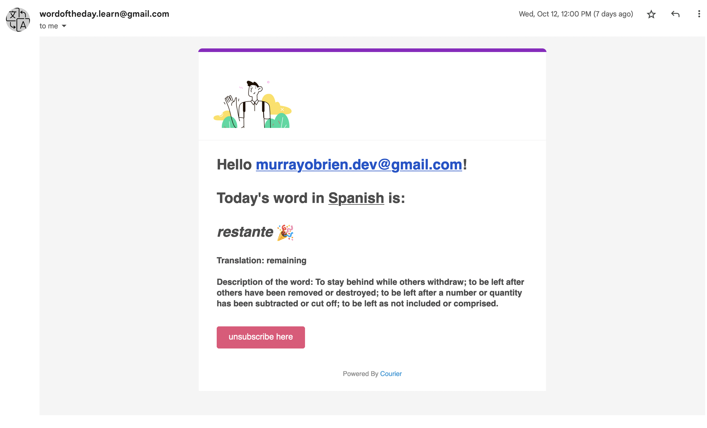
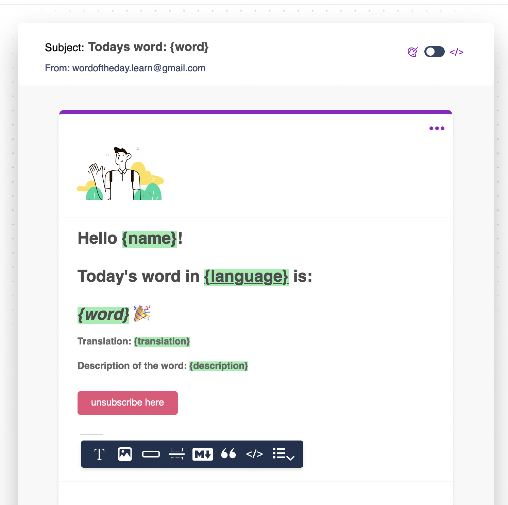

# Learn A New Word Every Day



## Background

I moved to Spain this year and I wanted to learn as much Spanish as possible but between working a 9 - 5 and other interests I find it difficult to find the time to learn new vocabulary. Even learning one word per day or having a reminder to learn can help.

So the app that I decided to build and app that we'll build today is called Word of the Day and will send you a new word in any language of your choice and its translation to help you learn new vocabulary.

I built this app using Courier's API, Node.js SDK, email designer and Express.js. I chose Express.js because JavaScript is the language I'm most comfortable with and Express.js is great to use. Courier also already had an SDK in Node.js so it was really simple to implement. Some other tools I used were Tailwind for easy styling and Heroku for hosting as its commonly used to host Express.js apps and has a good free tier.

## Instructions

### Part 1: Project Setup

We'll begin with setting up this project. I started with a blank Express.js project which you can follow on express' documentation. I then added a couple packages including axios and dotenv so that we can make requests to various API's and store our secret variables in a file called .env. Another important package we'll add is Courier's Node.js SDK to interact with their API easily. I also converted my project to TypeScript which you can learn how to do from a link below so keep in mind I'll be using TypeScript but if you know the different syntax for importing packages in TypeScript compared to JavaScript, you'll be able to keep up.

1. Create Express app:
   ```
   npm init && npm install express
   ```
2. Install packages

   ```
   npm install axios && npm install dotenv && npm install @trycourier/courier
   ```

3. In your index.ts or index.js if using JavaScript, we'll import dotenv and initialise it.

```typescript
import dotenv from "dotenv";
dotenv.config();
//express...
const app: Express = express();
const port = process.env.PORT;
```

### Part 2: Main Functionality

We'll now create the main functionality/functions for the app.

1. Before we start coding the functions, we need to add a few more secret variables to our .env file. We'll be using 3 API's to get the job done. The first API is Courier that will allow us to send notifications to multiple users which requires an API key that we must create along with an email address that will send the emails (notification channel) in this case. The second is Google Cloud Translation API that will allow us to translate any word into a language of our choosing. The third API is from RapidAPI that will return a description of the word that we give it.

```
   PORT=3000
   courier_email=""
   courier_api_key=""
   google_api_key=""
   rapid_api_key=""
   rapid_api_host=""
```

2. Now that we have our API priveleges setup we can begin coding and interacting with them. I'm going to start off with our main function so that you get an idea from top to bottom and we can handle each step afterwards. This function can be called from a CRON job so that it can automatically send the users' their notifications. We'll call it createWordOfTheDay(). It includes 3 functions/steps:

- 1. Fetch a random word (in English)
- 2. Fetch a description of that word
- 3. Send the word to its users and translate depending on the users language choice.

```typescript
export const createWordOfTheDay = async () => {
  //1. fetch random word
  const englishWord = await fetchRandomEnglishWord();
  //2. fetch description of the word
  const wordDescription = await fetchWordDescription(englishWord);
  //3. create object and send the word of the day to the users.
  const wordOfTheDay = {
    translation: englishWord,
    description: wordDescription,
  };
  await sendWordOfTheDay(wordOfTheDay);
};
```

3. Let's break down those 3 steps from above and look at those 3 functions together.

```typescript
   //STEP 1: Using axios we'll query the random word api from RapidAPI.
   const fetchRandomEnglishWord = async () => {
      const options: any = {
         method: "GET",
         url: "https://random-words5.p.rapidapi.com/getRandom",
         headers: {
            "X-RapidAPI-Key": process.env.rapid_api_key,
            "X-RapidAPI-Host": process.env.rapid_api_host,
         },
      };
      const word = axios
         .request(options)
         .then((response) => {
            return response.data;
         })
         .catch((error) => {
            console.error(error);
         });
      return word;
   };

   //STEP 2: Nearly identical to STEP 1, we'll fetch the description of the word from STEP 1. from another API.
   const fetchRandomEnglishWord = async () => {
      const options: any = {
         method: "GET",
         url: "https://random-words5.p.rapidapi.com/getRandom",
         headers: {
            "X-RapidAPI-Key": process.env.rapid_api_key,
            "X-RapidAPI-Host": process.env.rapid_api_host,
         },
      };
      const word = axios
         .request(options)
         .then((response) => {
            return response.data;
         })
         .catch((error) => {
            console.error("And error occurred");
            console.error(error);
         });
      return word;
   };

   //STEP 3: We'll need to break this function down further but I'll try explain each line with comments.
   export const sendWordOfTheDay = async (wordOfTheDay: IWordOfTheDay) => {
      //3.1 Fetch users, I used Firebase to store and fetch my users but I'll leave that up to you, so for now we'll hardcode our users.
      const users = [
         email: "abc@gmail.com", language: "es",
         email: "test@gmail.com", language: "ge",
      ];
      //Using npm package lodash, I'm combining users with same chosen language into a single array.
      const groupedByLanguage: any = _.values(_.groupBy(users, "language"));
      //translate word for all the user
      for (const users of groupedByLanguage) {
         //get language of grouped users
         const language = users[0].language;
         //Translate our word:
         const translatedWord = await translateWord(
            wordOfTheDay.translation,
            language
         );
         let newWordOfTheDay = wordOfTheDay;
         newWordOfTheDay.word = translatedWord;
         //send to users who subscribe to the same language
         await mailWord(users, newWordOfTheDay);
      }
   };
```

### Part 3: Send our users the translated word and its description

Finally, let's have a look at our method for sending the notification to our users. This is done in our function called mailWord() which is called in step 3 above this. This function requires an array of users who are subscribed to the same language and the WordOfTheDay object which contains the translated word and its description. This function also uses an email template that I created using Couriers Notification Designer where you can pass variables. Your template can be used and referenced below by an id which you can find on the Notification Designer.

```typescript
export const mailWord = async (users: IUser[], wordOfTheDay: IWordOfTheDay) => {
  //Initialize courier client from secret variable specified in your .env file
  const courier = CourierClient({
    authorizationToken: process.env.courier_api_key,
  });

  //Create an array of objects so that Courier can send to all these users with one API call.
  const list = users.map((user) => {
    return {
      email: user.email,
      data: {
        name: user.email,
        word: wordOfTheDay.word,
        language: getLanguageNameByCode(user.language),
        translation: wordOfTheDay.translation,
        description: wordOfTheDay.description,
      },
    };
  });

  //Final step is send.
  const { requestId } = await courier.send({
    message: {
      to: list,
      template: "HECEE75KFB4V01PTKX7F06H6F5ZP",
    },
  });
};
```



## Conclusions

Go check the project out over at Devpost : https://devpost.com/software/word-of-the-day-4l6rqj

Demo project at: https://courier-hackathon.herokuapp.com/

## About the Author

I'm Murray, a Software Developer who is passionate about programming ecosystems, apps and programming languages. I love learning new concepts, techniques and skills that can contribute to something practical. I currently work as a Software Developer and am grateful to work on a variety of projects. In my free time I enjoy traveling, surfing, kiting and making music.

## Quick Links

🔗 Express.js: https://expressjs.com/en/starter/generator.html
🔗 Use TypeScript with Express.js: https://medium.com/@mhuckstepp/step-by-step-guide-to-convert-an-existing-express-node-js-backend-to-typescript-931e435ea95d
🔗 Courier template designer: https://www.courier.com/docs/courier-designer/notification-designer/notification-designer-overview/
🔗 Courier Node.js SDK: https://www.courier.com/docs/guides/getting-started/nodejs/
